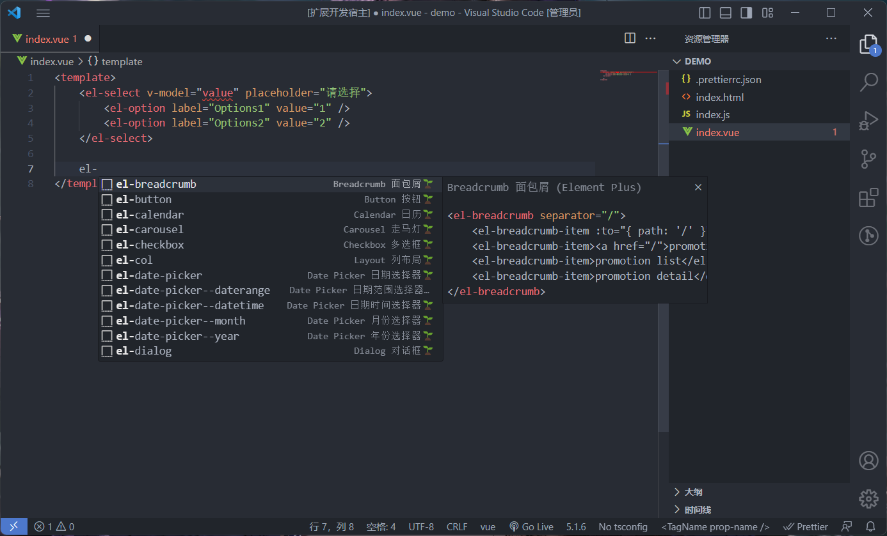

  

    
    
    

# Element Plus Snippets

基于 `Element Plus` 实现的一款代码提示插件

语法采用 `4` 个空格缩进的形式

## 特性

-   开箱即用：安装插件后，即可直接在代码中使用

-   组件支持：提供了大部分常用组件的语法提示

## 开始第一个语法提示

在 `.vue` 文件中输入 `el-` 时就会出现一系列 `Element Plus` 组件的代码提示。

 

## 目前支持的组件提示

Basic 基础组件

|     触发建议     | 说明               |
| :--------------: | :----------------- |
|  `<el-button>`   | `Button 按钮`      |
|    `<el-row>`    | `Layout 行布局`    |
|    `<el-col>`    | `Layout 列布局`    |
|   `<el-link>`    | `Link 链接`        |
| `<el-scrollbar>` | `Scrollbar 滚动条` |

Form 表单组件

|      触发建议      | 说明                     |
| :----------------: | :----------------------- |
|  `<el-checkbox>`   | `Checkbox 多选框`        |
| `<el-date-picker>` | `Date Picker 日期选择器` |
|    `<el-form>`     | `Form 表单`              |
|    `<el-input>`    | `Input 输入框`           |
|    `<el-radio>`    | `Radio 单选框`           |
|   `<el-select>`    | `Select 选择器`          |
|   `<el-switch>`    | `Switch 开关`            |
| `<el-time-picker>` | `Time Picker 时间选择器` |
| `<el-time-select>` | `Time Select 时间选择器` |

Data 数据展示

|     触发建议      | 说明              |
| :---------------: | :---------------- |
|  `<el-calendar>`  | `Calendar 日历`   |
|  `<el-carousel>`  | `Carousel 走马灯` |
|   `<el-image>`    | `Image 图片`      |
| `<el-pagination>` | `Pagination 分页` |
|   `<el-table>`    | `Table 表格`      |
|    `<el-tag>`     | `Tag 标签`        |

Navigation 导航

|     触发建议      | 说明                |
| :---------------: | :------------------ |
| `<el-breadcrumb>` | `Breadcrumb 面包屑` |
|    `<el-tabs>`    | `Tabs 标签页`       |

Feedback 反馈组件

|   触发建议    | 说明            |
| :-----------: | :-------------- |
| `<el-dialog>` | `Dialog 对话框` |
| `<el-drawer>` | `Drawer 抽屉`   |
