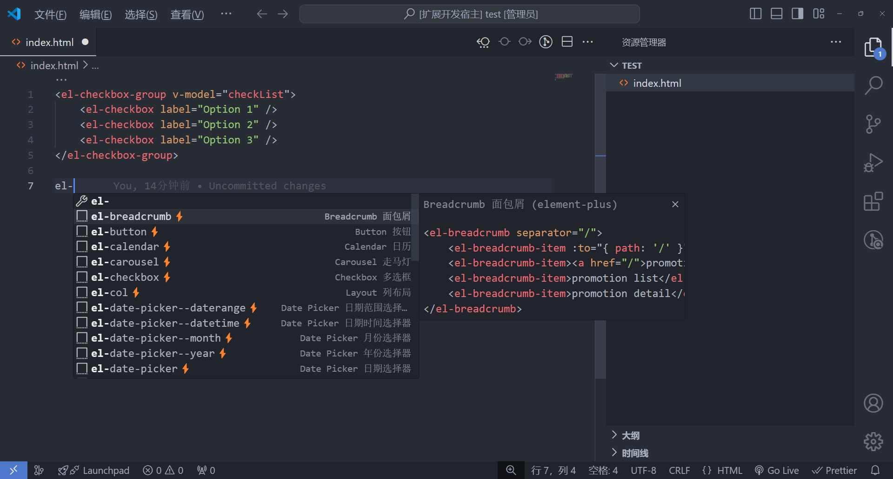
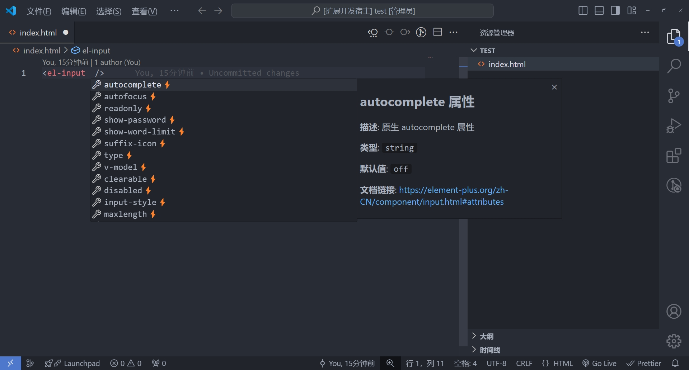

  

    
    
    

# Element Plus Snippets

🚀 Element Plus Snippets 是一个为 Element Plus 组件库提供代码提示的 VSCode 插件，帮助你快速开发 Vue 组件，提高编码效率。另外提供博主的学习笔记：https://note.noxussj.top/?s=ep

## ✨ 插件特性

-   支持 `Element Plus ⚡` 组件代码片段：为每个组件提供代码片段提示。

-   属性与事件提示：在组件中输入空格或 @ 符号，提供相关的属性或事件提示。

-   API 文档快速跳转：支持快速跳转到对应的组件 API 文档，查阅官方文档更方便

-   兼容多种文件类型：兼容 `.vue` `.html` 文件。

-   使用前必须要检查 Visual Code 的版本号是否大于 `1.46.0`

 

## 组件代码片段提示

✅ 例如在 `.vue` 文件中输入 `el-` 时就会出现一系列 `Element Plus` 组件的代码提示。

 

✅ 在组件中输入空格、或者手动触发属性提示

 

✅ 在组件中输入 `@` 触发事件提示

## 📌 支持的组件

以下是本插件支持的 `Element Plus` 组件代码片段，所有组件均支持代码补全、属性 & 事件提示。

### Basic 基础组件

| 序号 |    触发代码    | 组件名称          | 符号 |
| :--- | :------------: | :---------------- | :--- |
| 2    |  `el-button`   | Button 按钮       | ⚡   |
| 3    | `el-container` | Container 容器    | ⚡   |
| 4    |  `el-header`   | Header 页头       | ⚡   |
| 6    |   `el-aside`   | Aside 侧边栏      | ⚡   |
| 6    |   `el-main`    | Main 主要区域容器 | ⚡   |
| 5    |  `el-footer`   | Footer 页脚       | ⚡   |
| 7    |   `el-icon`    | Icon 图标         | ⚡   |
| 34   |    `el-row`    | Row 行            | ⚡   |
| 35   |    `el-col`    | Col 列            | ⚡   |
| 8    |   `el-link`    | Link 链接         | ⚡   |
| 9    |   `el-text`    | Text 文本         | ⚡   |
| 10   | `el-scrollbar` | Scrollbar 滚动条  | ⚡   |
| 11   |   `el-space`   | Space 间距        | ⚡   |

### Form 表单组件

| 序号 |     触发代码      | 组件名称                        | 符号 |
| :--- | :---------------: | :------------------------------ | :--- |
| 12   | `el-autocomplete` | Autocomplete 自动补全输入框     | ⚡   |
| 14   |   `el-cascader`   | Cascader 级联选择器             | ⚡   |
| 17   |   `el-checkbox`   | Checkbox 多选框                 | ⚡   |
| 15   | `el-color-picker` | Color Picker 颜色选择器         | ⚡   |
| 18   | `el-date-picker`  | DatePicker 日期选择器           | ⚡   |
| 20   |     `el-form`     | Form 表单                       | ⚡   |
| 22   |    `el-input`     | Input 输入框                    | ⚡   |
| 21   | `el-input-number` | Input Number 数字输入框         | ⚡   |
| 21   |  `el-input-tag`   | Input Tag 标签输入框            | ⚡   |
| 23   |   `el-mention`    | Mention 提及                    | ⚡   |
| 26   |    `el-radio`     | Radio 单选框                    | ⚡   |
| 27   |     `el-rate`     | Rate 评分                       | ⚡   |
| 29   |    `el-select`    | Select 选择器                   | ⚡   |
| 28   |  `el-select-v2`   | Virtualized Select 虚拟化选择器 | ⚡   |
| 36   |    `el-slider`    | Slider 滑块                     | ⚡   |
| 37   |    `el-switch`    | Switch 开关                     | ⚡   |
| 38   | `el-time-picker`  | Time Picker 时间选择器          | ⚡   |
| 39   | `el-time-select`  | Time Select 时间选择            | ⚡   |
| 40   |   `el-transfer`   | Transfer 穿梭框                 | ⚡   |
| 41   | `el-tree-select`  | TreeSelect 树形选择             | ⚡   |
| 42   |    `el-upload`    | Upload 上传                     | ⚡   |

### Data 数据展示

| 序号 |     触发代码      | 组件名称                     | 符号 |
| :--- | :---------------: | :--------------------------- | :--- |
| 43   |    `el-avatar`    | Avatar 头像                  | ⚡   |
| 44   |    `el-badge`     | Badge 徽标                   | ⚡   |
| 45   |   `el-calendar`   | Calendar 日历                | ⚡   |
| 46   |     `el-card`     | Card 卡片                    | ⚡   |
| 48   |   `el-carousel`   | Carousel 走马灯              | ⚡   |
| 33   |   `el-collapse`   | Collapse 折叠面板            | ⚡   |
| 50   | `el-descriptions` | Descriptions 描述列表        | ⚡   |
| 51   |    `el-empty`     | Empty 空状态                 | ⚡   |
| 53   |    `el-image`     | Image 图片                   | ⚡   |
| 54   |  `el-pagination`  | Pagination 分页              | ⚡   |
| 55   |   `el-progress`   | Progress 进度条              | ⚡   |
| 56   |    `el-result`    | Result 结果                  | ⚡   |
| 58   |   `el-skeleton`   | Skeleton 骨架                | ⚡   |
| 61   |    `el-table`     | Table 表格                   | ⚡   |
| 59   |   `el-table-v2`   | Virtualized Table 虚拟化表格 | ⚡   |
| 63   |     `el-tag`      | Tag 标签                     | ⚡   |
| 64   |   `el-timeline`   | Timeline 时间线              | ⚡   |
| 66   |     `el-tour`     | Tour 漫游式引导              | ⚡   |
| 67   |     `el-tree`     | Tree 树形控件                | ⚡   |
| 68   |   `el-tree-v2`    | Tree V2 虚拟化树形控件       | ⚡   |
| 69   |  `el-statistic`   | Statistic 统计组件           | ⚡   |
| 70   |  `el-segmented`   | Segmented 分段控制器         | ⚡   |

### Navigation 导航

| 序号 |     触发代码     | 组件名称          | 符号 |
| :--- | :--------------: | :---------------- | :--- |
| 71   |    `el-affix`    | Affix 固钉        | ⚡   |
| 71   |   `el-anchor`    | Anchor 锚点       | ⚡   |
| 71   |   `el-backtop`   | Backtop 回到顶部  | ⚡   |
| 73   | `el-breadcrumb`  | Breadcrumb 面包屑 | ⚡   |
| 73   |  `el-dropdown`   | Dropdown 下拉菜单 | ⚡   |
| 76   |    `el-menu`     | Menu 菜单         | ⚡   |
| 77   | `el-page-header` | PageHeader 页头   | ⚡   |
| 78   |    `el-steps`    | Steps 步骤条      | ⚡   |
| 81   |    `el-tabs`     | Tabs 标签页       | ⚡   |

### Feedback 反馈组件

| 序号 |    触发代码     | 组件名称              | 符号 |
| :--- | :-------------: | :-------------------- | :--- |
| 82   |   `el-alert`    | Alert 提示            | ⚡   |
| 83   |   `el-dialog`   | Dialog 对话框         | ⚡   |
| 84   |   `el-drawer`   | Drawer 抽屉           | ⚡   |
| 85   | `el-popconfirm` | Popconfirm 气泡确认框 | ⚡   |
| 86   |  `el-popover`   | Popover 弹出框        | ⚡   |
| 87   |  `el-tooltip`   | Tooltip 文字提示      | ⚡   |

### Others 其他

| 序号 |   触发代码   | 组件名称       | 符号 |
| :--- | :----------: | :------------- | :--- |
| 88   | `el-divider` | Divider 分割线 | ⚡   |

 
